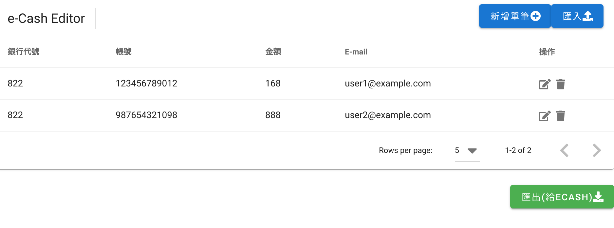

# e-Cash editor
*本程式非中國信託官方工具，純屬方便個人編輯使用



## Demo Site
[https://ecash-editor.web.app/](https://ecash-editor.web.app/)


## Project Description

### Goal
提供一個網頁版的介面來編輯中國信託的批次轉帳檔

### Problem
1. 中國信託的e-Cash網站要批次轉帳一定要透過檔案上傳的方式，需要透過一個檔案編輯工具來編輯。
2. 該工具只支援windows, Mac(beta)，Linux使用者感到困擾。而且該工具還要另外安裝java環境

### Solution
簡單做一個網頁版的工具來新增，編輯批次匯款的檔案。
需求：只用javascript在client端來處理，不回傳任何資料到server。

### Tools & Frameworks
1. Vue
2. Vuetify

## Functions
- [x] 新增/編輯/刪除 匯款資料
- [x] 下載成e-Cash可以讀取的檔案
- [x] 匯入e-Cash檔案內容
- [ ] 直接讀取e-Cash檔案

## Project setup
```
npm install
```

### Compiles and hot-reloads for development
```
npm run serve
```

### Compiles and minifies for production
```
npm run build
```

### Customize configuration
See [Configuration Reference](https://cli.vuejs.org/config/).
